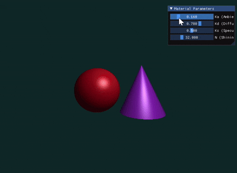
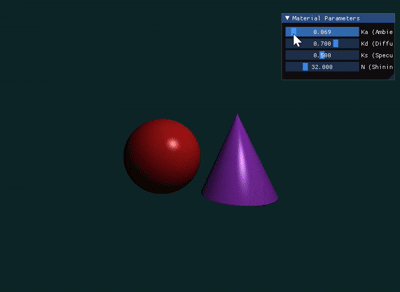

# Computer Graphics Lab: Ray Casting, Phong Shading & Shadows

[](https://www.taichi-lang.org/)

本实验基于 **Taichi** 高性能计算框架，实现了三维场景的 GPU 光线投射（Ray Casting）引擎。项目重点探究了光照模型（Phong vs Blinn-Phong）的视觉差异，并成功引入了硬阴影技术与参数交互调节界面。


## 🚀 项目概览

* 核心功能：利用数学隐式方程在 GPU 上并行渲染三维场景。

* 技术栈：Python 3.12, Taichi Lang。

* 光照模型：支持切换至 Blinn-Phong，包含漫反射（Diffuse）、环境光（Ambient）及镜面高光（Specular）。

* 特殊效果：基于暗影射线（Shadow Ray）的硬阴影计算，解决了阴影粉刺（Shadow Acne）问题。

## 📸 实验效果演示

以下展示了通过实时调整 `Shininess` 与材质系数，以及物体间产生的实时阴影遮挡效果：

#### Blinn-Phong 模型



#### 经典 Phong 模型



*演示说明：通过交互面板实时改变材质属性，观察高光形态的丝滑变化及遮挡产生的物理阴影。*


## 🛠️ 环境配置与运行

### 依赖环境
* Python 3.12+
* [Taichi](https://docs.taichi-lang.org/) (用于 GPU 并行渲染)


### 运行程序

在终端执行以下命令即可启动渲染窗口：

```bash
uv run main.py

```


## 🧪 实验过程与探究

### 1. 光照模型对比

实验对比了经典 Phong 模型与升级后的 Blinn-Phong 模型：

* **核心原理**：Phong 使用反射向量 $\mathbf{R}$ 与视线 $\mathbf{V}$ 的夹角；Blinn-Phong 则计算半程向量 $\mathbf{H}$ 与法线 $\mathbf{N}$ 的夹角。
* **视觉探究**：在测试中发现，Phong 模型在大角度入射时存在高光突兀截断（Cutoff）现象。引入 Blinn-Phong 后，通过计算 ，高光区域的过渡变得更加平滑且符合物理感知。

### 2. 硬阴影 (Hard Shadow) 实现

* **技术难点**：在交点处发射暗影射线（Shadow Ray）时，易发生“阴影粉刺（Shadow Acne）”现象，即表面产生错误的黑色噪点。
* **解决方案**：引入了浮点偏移 $\epsilon = 10^{-4}$，将暗影射线起点沿法线方向稍微抬高，确保射线不与自身表面发生重叠计算。
* **结论**：阴影的引入极大地增强了场景的立体感，使得球体与圆锥具备了真实的空间位置关系。

### 3. 材质参数实时探究

通过 GUI 滑动条，我们对渲染参数进行了动态分析：

| 参数 | 物理意义 | 视觉影响 |
| --- | --- | --- |
| **Ka** | 环境光系数 | 调高可提亮阴影区的背景细节。 |
| **Kd** | 漫反射系数 | 控制物体对光线的散射程度，影响颜色深浅。 |
| **Ks** | 镜面高光系数 | 越高，物体表面质感越接近金属或高光泽塑料。 |
| **Shininess** | 高光指数 | 值越大（Max 128），高光斑点越小且越集中。 |


## 📂 项目结构

```text
.
├── main.py               # 经典 Phong 模型渲染逻辑与交互 GUI 实现
├── plus.py               # Blinn-Phong 模型渲染逻辑与交互 GUI 实现
├── assets/               # 存放演示图片与 GIF
│   └── demo_main.gif     # 经典 Phong 模型实验结果动态展示
│   └── demo_plus.gif     # Blinn-Phong 模型实验结果动态展示
└── README.md             # 项目文档与实验报告

```


## 📝 实验结论

本次实验验证了基于隐式几何体定义的渲染流程。

1. **并行渲染**：得益于 Taichi 的并行架构，实现了百万级像素的实时更新。
2. **模型优化**：Blinn-Phong 的引入有效提升了渲染的视觉质感。
3. **空间感知**：硬阴影是三维场景中不可或缺的视觉锚点，极大地增强了渲染引擎的真实度。
